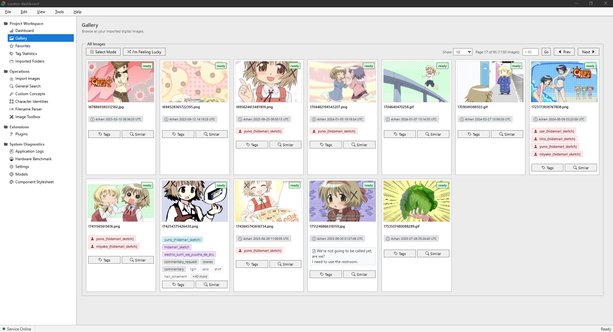

# Project Curator

A high-performance, **local-first** asset curation engine for large image and video archives — semantic search, auto-tagging, OCR, character identification, and an extensible plugin system, all running entirely on local hardware.



## Overview

Project Curator is a local-first digital asset management (DAM) engine. Unlike cloud or hybrid solutions, all inference, indexing, and metadata storage happen on the user's machine — image data, tags, and AI model weights never leave the local environment.

The system is built around a **single-writer background service**: the `curator-service` daemon owns the SQLite database and the vector index, runs all ONNX model inference, and exposes a gRPC API over a local Named Pipe (Windows) or Unix Domain Socket (macOS/Linux). The desktop GUI, headless CLI, and plugins are all clients of that one service — they never touch storage directly.

**Non-destructive by design:** original files, folder layouts, and embedded sidecars are never modified, moved, or renamed. Everything is read, analyzed, and cached in isolation.

---

## Feature Overview

### Multi-Modal Search

| Modality | Description |
| --- | --- |
| **Semantic (CLIP)** | Natural-language query mapped into a 512-d visual feature space. Embedding models: **CLIP ViT-B/32** (default) or **MobileCLIP S2**. |
| **Danbooru-style auto-tagging** | Two selectable multi-label taggers: **Camie Tagger v2** (default) and **WD EVA02 Tagger 2026 Canary** (optional; safetensors weights converted to ONNX in-app). Namespaced tag categories, tag blacklisting, confidence thresholds. |
| **NSFW safety classification** | EfficientNet-based 5-class image safety classifier (Safe, Neutral, Suggestive, Explicit, Extreme). Safetensors converted to ONNX in-app with FP16 quantization, configurable safety tagging, and gallery blur filters. |
| **Reverse image search** | Query by image path — find visual lookalikes, composition variants, and near-duplicates via stored embeddings. |
| **OCR text search** | PP-OCRv6 text detection/recognition with full-text search over in-image text. Optional textline orientation classifier and **manga speech-bubble detection** (quantized int8 YOLO). |
| **Filename regex parsing** | Token-block builder compiles user rules into regex to extract artist names, dates, custom IDs, etc. Live test, batch preview, and batch apply modes. |
| **Custom concepts** | Train personalized concept vectors from sample images (e.g., an art style or niche subject) for similarity matching, with clean auto-tag removal. |
| **Character identification** | YOLO anime person detection + CCIP feature/metric embeddings. Assign detections to named character identities, auto-identify across the library, and search by character. |

### Media Support

- **Images:** PNG, JPEG, WebP, animated GIF, BMP, TIFF, QOI, TGA, PNM, HDR, ICO, EXR, AVIF. Supports custom per-image notes, star favoriting, and multi-selection batch actions.
- **Animated GIFs:** per-frame metadata, animation timing, and loop count; a full create/crop/resize/effect/caption editor ships as the GIF Maker plugin.
- **Videos:** MP4 and WebM probed via **FFmpeg** (dimensions, duration, fps, codecs, bitrate) with WebP frame previews. A background **transcoding service** converts between formats and codecs with live progress reporting. FFmpeg is auto-detected, or a portable build can be downloaded into the data directory.
- Thumbnails and detection-crop thumbnails are generated on demand and cached in a dedicated SQLite cache.

### Extensible Plugin System

- Plugins are self-contained TypeScript bundles (`index.js`) declared by a `manifest.json` (name, version, permissions) and loaded by the dashboard's plugin host.
- Built with **esbuild** from a TypeScript workspace that ships a shared `lib/` (logging, IPC utilities, drop-zone handling, progress polling).
- Bundled plugins: **Image Converter**, **FFmpeg Transcoder**, **Image Compare**, **GIF Maker**, and **miniPaint** (full offline raster editor with layers, filters, and drawing tools).

### Toolbox (Ephemeral Processing)

Run one-off operations on arbitrary files **without touching the library**: auto-tag, OCR, character detection, or batch image conversion against any path.

### Model Management

- Curated `model_manifest.json` catalog of ONNX models (embedding, tagging, detection, OCR, safety classification) fetched from Hugging Face.
- Download manager with live progress and cancellation; optional **int8/fp16 quantization**; in-app **safetensors → ONNX conversion** for WD EVA02 and NSFW detection; portable **FFmpeg** download.
- Per-pipeline device preference (`auto` / `cpu` / `gpu`) and model precision, plus CPU-vs-GPU benchmarks for every model.

---

## System Architecture

```txt
┌────────────────────────────────────────────────────────────────────────┐
│  Clients                                                               │
│  ┌────────────────────┐  ┌───────────────┐  ┌────────────────────────┐ │
│  │  curator-dashboard │  │ curator-cli   │  │ Plugins (bundled JS,   │ │
│  │  Tauri v2 + Vite   │  │ headless CLI  │  │ injected UI panels)    │ │
│  └─────────┬──────────┘  └──────┬────────┘  └────────────┬───────────┘ │
└────────────┼────────────────────┼────────────────────────┼─────────────┘
             │        gRPC over Named Pipe / Unix Domain Socket          
             └────────────────────┼────────────────────────┘
┌─────────────────────────────────▼──────────────────────────────────────┐
│  curator-service  (single-writer background daemon)                    │
│  ├── SQLite metadata store   (sqlx + versioned migrations)             │
│  ├── USearch vector index    (in-memory dynamic index, 512-d)          │
│  ├── ONNX Runtime inference  (DirectML / CoreML / CUDA / ROCm / CPU)   │
│  │     ├── CLIP & MobileCLIP embeddings                                │
│  │     ├── Camie & WD EVA02 taggers                                    │
│  │     ├── YOLO person detection + CCIP character ID                   │
│  │     ├── PP-OCRv6 text detection/recognition + bubble detector       │
│  │     └── NSFW image safety classification                            │
│  ├── Background worker       (vector indexing job queue)               │
│  └── Thumbnail / crop cache  (SQLite)                                  │
└────────────────────────────────────────────────────────────────────────┘
```

**Core IPC bus:** all client-to-service traffic is strongly-typed gRPC (tonic/prost in Rust, `@bufbuild/protobuf` in TypeScript) over a local transport — Windows Named Pipe `\\.\pipe\curator_ipc` on Windows, `~/.curator/curator.sock` Unix Domain Socket elsewhere. Requests are serialized to raw Protobuf binary (`.toBinary()` / `.fromBinary()`) and sent through Tauri's `send_to_service_typed` IPC bridge from the frontend; a per-install **service key** authenticates clients. The engine internals are organized into modular workspace crates (`curator-proto`, `curator-media`, `curator-db`, `curator-ml`, `curator-filename-parser`) whose public API is re-exported by `curator-core`, so `curator-service`, `curator-cli`, and the Tauri bridge compile against a single aggregator.

**Storage philosophy:** relational metadata (images, tags, sources, character detections, OCR results, notes, safety classifications) lives in SQLite; dense 512-d embeddings live in an isolated in-memory USearch vector index. Original files are never mutated.

---

## Repository Layout

```bash
project-curator/
├── curator-proto/            # Leaf contracts crate: 16 gRPC .proto specs, generated Tonic stubs,
│   └── proto/                #   shared kernel (DevicePreference/TaggerModel), constants, util, IPC transport
├── curator-filename-parser/  # Rule & tokenizer engine: presets, token blocks, batch filename parsing
├── curator-media/            # High-performance media engine: TurboJPEG/WebP/GIF decode, video, thumbnails, CropCache
├── curator-db/               # SQLite schema, versioned migrations, models, and HNSW vector storage
│   └── migrations/           # Versioned SQL migrations (schema → media metadata)
├── curator-ml/               # ONNX Runtime engine: CLIP/MobileCLIP, YOLO, OCR, taggers, safety, concepts, benchmarks
│   └── src/bin/              # Standalone ONNX model-verification binaries
├── curator-core/             # Aggregator/orchestrator: domain DTOs, grpc_convert, re-exports of child crates
│   └── src/bin/              # Standalone pipeline test & benchmark binaries
├── curator-service/          # Background daemon: single-writer, task queue, gRPC server,
│   └── src/handlers/         #   model download/quantize/convert, FFmpeg transcode jobs
├── curator-cli/              # Headless CLI client for scripting & agent integration
├── curator-dashboard/        # Tauri v2 + Vite + TypeScript desktop UI
│   ├── src-tauri/            # Tauri Rust backend glue & typed binary IPC bridge (workspace member)
│   └── src/                  # TS UI views, RPC clients (callSearch/callGallery), gen/ stubs
├── plugins/                  # TypeScript plugin workspace (esbuild bundles + shared lib/)
├── docs/                     # Design document, image-processing & ML porting guides
├── scripts/                  # Model conversion / quantization helpers (Python venv)
└── .curator/                 # Local runtime state: models, vector index, SQLite DB
```

The dashboard exposes standard views (Dashboard, Gallery, Favorites, Tag Statistics, Folders, Import, Search, Concepts, Characters, Filename Parser, Toolbox, Plugins, Logs, Benchmark, Settings, Models, and Component Stylesheet) along with dynamically registered plugin views injected into the sidebar navigation.

---

## Requirements

- Windows 10+ (primary target; GPU acceleration via DirectML)
- PowerShell 5.1+
- Rust stable — or use the isolated workspace toolchain (see below)
- Node.js + npm (dashboard frontend)
- SSD recommended for the database and vector index

> **GPU acceleration:** `onnxruntime.dll` + `DirectML.dll` are required for GPU inference on Windows; CPU fallback is fully supported. macOS/Linux targets are scaffolded (CoreML / CUDA+ROCm providers, UDS transport), but Windows is the actively tested platform.

---

## Build & Setup

Project Curator is currently built from source; a portable, self-contained release is planned.

### 1. Clone

```powershell
git clone https://github.com/FuouM/Project-Curator
cd Project-Curator
```

### 2. Initialize the local Rust toolchain (optional, recommended)

Isolates Rust tooling inside the workspace and enables `sccache` incremental caching:

```powershell
.\setup_env.ps1
. .\env.ps1
```

### 3. Fetch ONNX Runtime (DirectML) and DirectML binaries

```powershell
.\download_ort.ps1
```

### 4. Install dashboard dependencies

```powershell
cd curator-dashboard
npm install
cd ..
```

### 5. Launch development mode

Compiles `curator-service`, then starts the Tauri desktop GUI:

```powershell
.\dev.ps1
```

### 6. Initialize models

Open **Settings → Models** and download the required models from the manifest. At minimum you need an **embedding model** (`CLIP ViT-B/32`) and a **tagger** (`Camie Tagger v2`). Detection, OCR, and the optional WD EVA02 tagger can be added later.

---

## CLI Usage

The headless client talks to a running `curator-service` over IPC:

```powershell
# Status & health
cargo run -p curator-cli -- status
cargo run -p curator-cli -- ping

# Import an image or a whole folder
cargo run -p curator-cli -- import "D:\Pictures\Anime\My Library"

# Search: semantic, reverse-image, or exact tag
cargo run -p curator-cli -- search "a quiet library at night"
cargo run -p curator-cli -- search --image "query.png"
cargo run -p curator-cli -- search --tag "1girl"

# Tags & auto-tagging
cargo run -p curator-cli -- tag add 42 "original" --category character
cargo run -p curator-cli -- tag-auto 42 --threshold 0.5
cargo run -p curator-cli -- tag-auto-batch --threshold 0.5
cargo run -p curator-cli -- tag-backfill --from camie --to wd-eva02

# Tagger & model diagnostics
cargo run -p curator-cli -- tagger-status
cargo run -p curator-cli -- benchmark --model clip-vit-b-32

# Plugin validation
cargo run -p curator-cli -- validate-plugin plugins\image-converter\manifest.json
```

---

## Development

```powershell
. .\env.ps1

# Tests
cargo test -p curator-core
cargo test -p curator-service

# Lint
cargo clippy --all-targets

# Build a specific crate
cargo build --manifest-path curator-core/Cargo.toml
cargo build --manifest-path curator-service/Cargo.toml
```

> **Note:** `cargo build` on `curator-service` fails with an access-denied error while `curator-service.exe` is running. Kill it first:
>
> ```powershell
> Get-Process curator-service -ErrorAction SilentlyContinue | Stop-Process -Force
> ```

### Building Plugins

```powershell
cd plugins
npm install
npm run build                                   # build all plugins
node build.js --plugin image-converter          # build a single plugin
npx tsc --project tsconfig.json                 # type-check the workspace
```

---

## Documentation

- [`docs/README.md`](docs/README.md) — Authoritative documentation index and technical reference hub
- [`AGENTS.md`](AGENTS.md) — Repository architecture, development workflows, and safety mandates
- [`PLUGINS_FOR_AGENTS.md`](PLUGINS_FOR_AGENTS.md) — Plugin development architecture and API blueprint
- [`docs/old/curator_design_document.md`](docs/old/curator_design_document.md) — Initial technical design document (preserved for archival reference)
- [`docs/ml/porting_guide.md`](docs/ml/porting_guide.md) — ML inference porting field guide and debugging workflows
- [`docs/media/image_and_video_processing.md`](docs/media/image_and_video_processing.md) — Fast media decoding and tensor preprocessing guide
